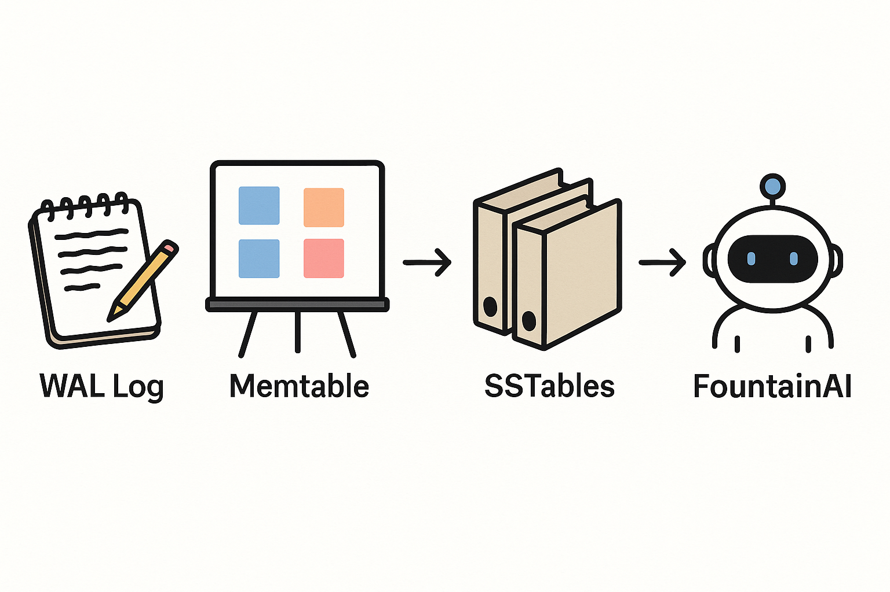

# FountainStore

**Status:** 0.2.0‑beta — stable engine, enriched HTTP surface (see What’s New) and unified docs.

FountainStore is a **pure‑Swift**, embedded, ACID persistence engine for FountainAI. The engine persists data to disk via a WAL and SSTables and reloads state on startup. It follows an LSM-style architecture (WAL → Memtable → SSTables) with MVCC snapshots,
secondary indexes, and optional FTS and Vector modules, all with zero non‑Swift dependencies.

See `agent.md` for Codex instructions and `docs/` for the full blueprint.

Benchmarks for put/get throughput live in `FountainStoreBenchmarks` and run in CI with JSON results uploaded as artifacts.

## What’s New (0.2.0)

- Enriched record responses (sequence/deleted); PUT returns 201/200 with Location
- Opaque pagination tokens (HMAC‑signed when API key configured) for lists/queries
- Prometheus metrics output via `GET /metrics?format=prometheus`
- Optional API key protection using SecretStore (Keychain/Secret Service/FileKeystore) or env
- Dynamic unique enforcement for HTTP‑defined indexes; dynamic index rebuild on startup
- Compaction preference for L0 groups with limited merges per tick; improved write backpressure

For the full development status and next steps see `docs/PROJECT_STATUS.md`.

## Highlights (vNext milestones)

- Persistent MVCC across restarts (sequence stored in SSTables)
- Transactional WAL replay (BEGIN/OP/COMMIT) and store-level multi-collection batch
- Index persistence in manifest; background rebuild on define
- SSTable per-block CRC and explicit Bloom serialization
- Compaction status with virtual levels and debt heuristic; simple backpressure under high debt
- Read caching (block cache) honoring `cacheBytes`
- Backup/restore API (`createBackup`, `listBackups`, `restoreBackup`)
- Multi-index expressiveness: array-valued key paths and extractor closures (`.multiValues { ... }`)
- Optional AdminService and lightweight HTTP server target

### Optional HTTP Server

An optional `FountainStoreHTTPServer` executable is provided for basic admin/observability:

```
swift run FountainStoreHTTPServer
# or
FS_PATH=/tmp/fs PORT=8080 swift run FountainStoreHTTPServer
```

Endpoints (minimal subset):
- `GET /health` – ok status
- `GET /status` – store status
- `GET /metrics` – metrics snapshot

Docs: OpenAPI is the source of truth (`docs/openapi-fountainstore.yaml`). The single development‑tracking doc is `docs/PROJECT_STATUS.md`. See `docs/INDEX.md` for the map. For an extended narrative overview, read `docs/LECTURE.md`.

#### HTTP Examples

Record upsert with enriched response metadata

```
# First write → 201 Created with Location and metadata
curl -i -X PUT \
  -H 'content-type: application/json' \
  -d '{"data": {"title": "First"}}' \
  http://127.0.0.1:8080/collections/docs/records/a1

HTTP/1.1 201 Created
Location: /collections/docs/records/a1
content-type: application/json

{
  "id": "a1",
  "data": { "title": "First" },
  "version": null,
  "sequence": 42,
  "deleted": false
}

# Update same record → 200 OK, metadata included
curl -s -X PUT \
  -H 'content-type: application/json' \
  -d '{"data": {"title": "Updated"}}' \
  http://127.0.0.1:8080/collections/docs/records/a1 | jq

{
  "id": "a1",
  "data": { "title": "Updated" },
  "version": null,
  "sequence": 43,
  "deleted": false
}
```

Pagination patterns (collections, indexes, backups)

```
# Page collections (pageSize + pageToken). nextPageToken is returned and opaque.
curl -s 'http://127.0.0.1:8080/collections?pageSize=2' | jq
{
  "items": [ {"name": "a", "recordsApprox": 0}, {"name": "b", "recordsApprox": 0} ],
  "nextPageToken": "b"
}

curl -s "http://127.0.0.1:8080/collections?pageSize=2&pageToken=$(jq -r .nextPageToken <<<"$prev")" | jq
{
  "items": [ {"name": "c", "recordsApprox": 0}, {"name": "d", "recordsApprox": 0} ],
  "nextPageToken": "d"
}

# Page indexes for a collection
curl -s 'http://127.0.0.1:8080/collections/docs/indexes?pageSize=1' | jq
{
  "items": [ {"name": "byTag", "kind": "multi", "keyPath": ".tag"} ],
  "nextPageToken": "byTag"
}

# Page backups (newest first); nextPageToken is opaque
curl -s 'http://127.0.0.1:8080/backups?pageSize=2' | jq
{
  "items": [ {"id": "bk_3", "createdAt": "2025-10-04T07:00:00Z"}, {"id": "bk_2", "createdAt": "2025-10-04T06:00:00Z"} ],
  "nextPageToken": "bk_2"
}
```

Query responses include pagination and metadata

```
curl -s -X POST \
  -H 'content-type: application/json' \
  -d '{"type": "indexEquals", "index": "byTag", "key": "x", "pageSize": 2}' \
  http://127.0.0.1:8080/collections/docs/query | jq

{
  "items": [
    {"id": "a1", "data": {"tag": "x"}, "sequence": 101, "deleted": false},
    {"id": "a2", "data": {"tag": "x"}, "sequence": 102, "deleted": false}
  ],
  "nextPageToken": "a2"
}
```

#### Metrics formats

- JSON (default): `GET /metrics`
- Prometheus text: `GET /metrics?format=prometheus`

#### API key management via SecretStore

The server can be protected via an API key (checked via `x-api-key` or `Authorization: Bearer …`).
The key can be provided via:

- Env var `FS_API_KEY`
- Apple platforms: Keychain (service `com.fountain.store.http`, key `FS_API_KEY`)
- Linux (desktop): Secret Service (set `FS_USE_SECRET_SERVICE=1`), entry `FS_API_KEY`
- Linux (headless): FileKeystore with `FS_SECRETSTORE_PATH` and `FS_SECRETSTORE_PASSWORD`

When no key is configured, the server runs without auth for local development.

### Backup/Restore

```
let ref = try await store.createBackup(note: "pre-migration")
let backups = await store.listBackups()
try await store.restoreBackup(id: ref.id)
```

Backups are stored under `<storePath>/backups/<id>/` and include `MANIFEST.json`, `wal.log`, and SSTable files.

### Multi-Value Indexes

```
struct Doc: Codable, Identifiable { var id: Int; var tags: [String] }
let coll = await store.collection("docs", of: Doc.self)
try await coll.define(.init(name: "byTag", kind: .multi(\Doc.tags)))
try await coll.define(.init(name: "byTag2", kind: .multiValues { $0.tags }))
```


## Installation

FountainStore is distributed as a Swift Package. To add it to your project, include the following dependency in your `Package.swift`:

```swift
dependencies: [
    .package(url: "https://github.com/Fountain-Coach/Fountain-Store.git", from: "0.2.0")
]
```

---

# Vision (For Everyone)

FountainStore is like a **digital filing cabinet** designed especially for FountainAI.

## Why It Matters
- **Safe**: Nothing gets lost, even if the system crashes mid‑save.
- **Fast**: Finds what you need instantly, even among millions of entries.
- **Private**: Runs locally inside FountainAI, with no outside servers involved.
- **Evolves**: Can adapt to new data shapes as FountainAI grows.

## Everyday Metaphors
- **Notebook**: Every change is first jotted down quickly (our write‑ahead log).
- **Whiteboard**: Recent items stay handy for quick access (our in‑memory store).
- **Binders**: Older notes are neatly archived in order (our on‑disk tables).
- **Librarian**: Keeps binders tidy, merging them for faster lookups (compaction).

## What People Can Do With It
- Save new records instantly and safely.
- Retrieve records by ID, tag, or keyword.
- Look back at how records looked in the past.
- Trust that data stays consistent and private.

## The Ambition
We’re not just building another database. We’re giving FountainAI its own **memory core** —
Swift‑native, reliable, and tuned to support everything from coaching interactions to planning
and narrative building.

---

For more detail, see [`docs/VISION.md`](docs/VISION.md).


---

# Visual Overview



This diagram shows the flow of data in FountainStore:

- **Notebook (WAL Log)** → quick jots of every change.
- **Whiteboard (Memtable)** → recent notes kept handy.
- **Binders (SSTables)** → long-term, sorted archive.
- **Librarian (Compaction)** → keeps binders tidy and efficient.
